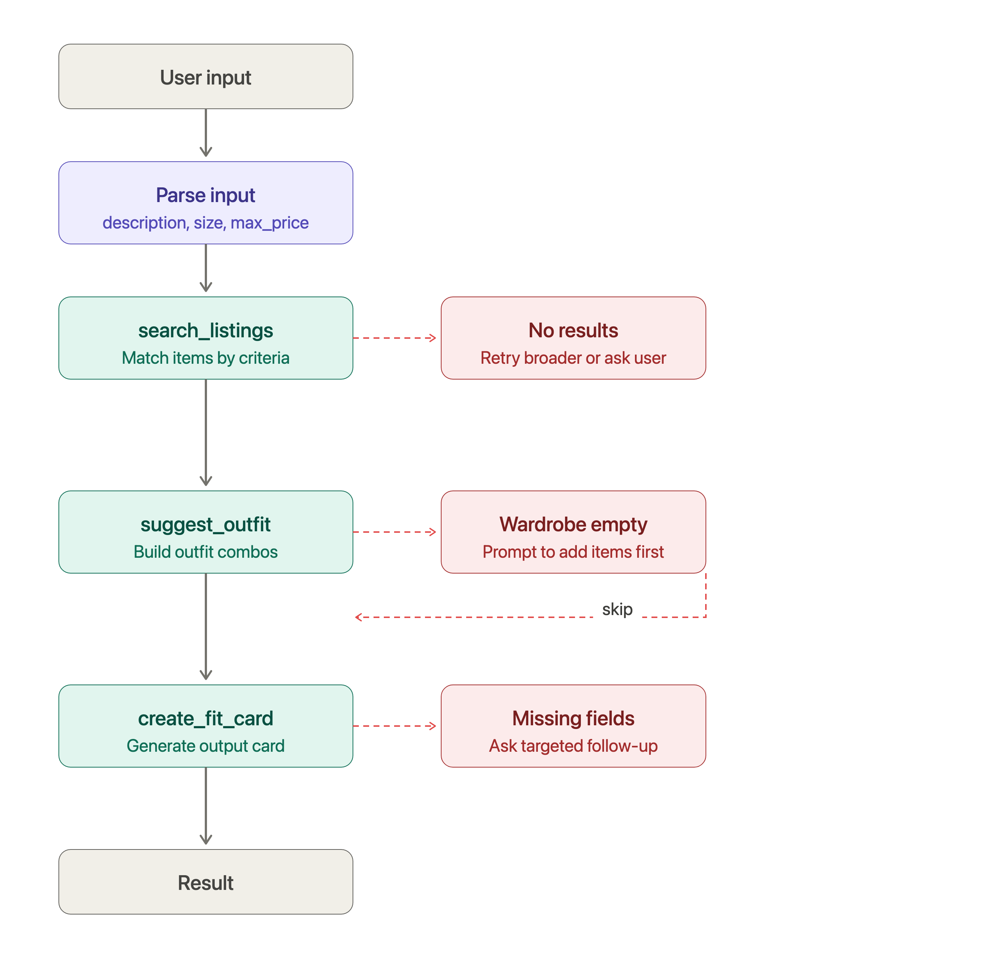

# FitFindr — planning.md

> Complete this document before writing any implementation code.
> Your spec and agent diagram are what you'll use to direct AI tools (Claude, Copilot, etc.) to generate your implementation — the more specific they are, the more useful the generated code will be.
> Your planning.md will be reviewed as part of your submission.
> Update it before starting any stretch features.

---

## Tools

List every tool your agent will use. For each tool, fill in all four fields.
You must have at least 3 tools. The three required tools are listed — add any additional tools below them.

### Tool 1: search_listings

**What it does:**
Searches listings data for information about product price, description, size and more depending on information
stored on the database.

**Input parameters:**
- `description` (str): keywords that are used to match with the listing descriptions and tags
- `size` (str): filters products that meet a certain size requirement and no argument means no constraint
- `max_price` (float): ceiling for the price of the item or none if no constraint needed

**What it returns:**
Returns listings that match given keywords and specifications. Also details what about the listings match the query

**What happens if it fails or returns nothing:**
If no listings match, the agent will return that a matching listing was not found or the query failed.

---

### Tool 2: suggest_outfit

**What it does:**
This takes tags given by the listing and attempts to match keywords to provide a comprehensive outfit.

**Input parameters:**
<!-- List each parameter, its type, and what it represents -->
- `new_item` (dict): the dictionary with data about the listing that user is looking for information about
- `wardrobe` (dict): another dictionary with a subdictionary of available items that with certain values listed about them

**What it returns:**
A string with suggestions for an outfit based on an existing wardrobe. If an existing wardrobe is not pulled from,
it should give general advice about the item.

**What happens if it fails or returns nothing:**
If it fails, the model should be able to realize that there is incomplete information to make an accurate statement.

---

### Tool 3: create_fit_card

**What it does:**
Gives a brief description about a given listing in a social media ready form given a suggested outfit and listing.

**Input parameters:**
<!-- List each parameter, its type, and what it represents -->
- `outfit` (str): The outfit suggestion string from suggest_outfit()
- `new_item` (dict): The listing dictionary corresponding to the specific item.

**What it returns:**
Returns a brief, social media optimized response.

**What happens if it fails or returns nothing:**
If the data is incomplete, the model should not go off its programming and report that it has incomplete information.
---

### Additional Tools (if any)

<!-- Copy the block above for any tools beyond the required three -->

---

## Planning Loop

**How does your agent decide which tool to call next?**

First the agent will parse the user's input for keywords. Then, it will call search_listings so that it has something to be the basis. Then,
it calls suggest_outfit using the top result from the keywords. Finally, it calls create_fit_card to make a social media post for the outfit.

## State Management

**How does information from one tool get passed to the next?**
The agent stores information within the session by keeping track of the messages sent in the session. Tool calls will have a specific dictionary signature that will show what the tool returned. 

---

## Error Handling

For each tool, describe the specific failure mode you're handling and what the agent does in response.

| Tool | Failure mode | Agent response |
|------|-------------|----------------|
| search_listings | No results match the query | Tool returns { results: [], count: 0 }. Agent sees empty results in history and either retries with a broader rephrased query, or tells the user no matches were found and asks them to adjust filters.|
| suggest_outfit | Wardrobe is empty | Tool returns an error like { error: "WARDROBE_EMPTY" }. Agent stops the outfit flow and prompts the user to add items first + it shouldn't call create_fit_card since there's nothing to work with. |
| create_fit_card | Outfit input is missing or incomplete | Tool returns { error: "MISSING_FIELDS", required: ["top", "bottom"] }. Agent uses the field list to ask a targeted follow-up ("What bottom did you want to pair with this?") rather than re-asking everything from scratch. |

---

## Architecture

<!-- Draw a diagram of your agent showing how the components connect:
     User input → Planning Loop → Tools (search_listings, suggest_outfit, create_fit_card)
                                                                          ↕
                                                                   State / Session
     Show what triggers each tool, how state flows between them, and where error paths branch off.
     ASCII art, a Mermaid diagram (https://mermaid.js.org/syntax/flowchart.html), or an embedded
     sketch are all fine. You'll share this diagram with an AI tool when asking it to implement
     the planning loop and each individual tool. -->

## AI Tool Plan

<!-- For each part of the implementation below, describe:
     - Which AI tool you plan to use (Claude, Copilot, ChatGPT, etc.)
     - What you'll give it as input (which sections of this planning.md, your agent diagram)
     - What you expect it to produce
     - How you'll verify the output matches your spec before moving on

     "I'll use AI to help me code" is not a plan.
     "I'll give Claude my Tool 1 spec (inputs, return value, failure mode) and ask it to implement
     search_listings() using load_listings() from the data loader — then test it against 3 queries
     before trusting it" is a plan. -->

- Which AI tool you plan to use (Claude, Copilot, ChatGPT, etc.)
     Claude

- What you'll give it as input (which sections of this planning.md, your agent diagram)
     I will give it the basic parameters for each tool: the arguments, the return, and some guidance as to what implementation should look like.

- What you expect it to produce
     I expect it to produce a rough outline for each tool that I can tweak for specific needs to this project or fix errors.

- How you'll verify the output matches your spec before moving on
     I will make sure keywords are matching and general formatting conventions for the project are followed. I will run test cases where applicable 
     to check for code errors.

**Milestone 3 — Individual tool implementations:**

**Milestone 4 — Planning loop and state management:**

---

## A Complete Interaction (Step by Step)

Write out what a full user interaction looks like from start to finish — tool call by tool call. Use a specific example query.

**Example user query:** "I'm looking for a vintage graphic tee under $30. I mostly wear baggy jeans and chunky sneakers. What's out there and how would I style it?"

**Step 1:**
<!-- What does the agent do first? Which tool is called? With what input? -->
The very first thing that happens is a new session is created and takes a query and a wardrobe in as input. The agent then parses the query for
max_price, description, and size. max_price and size are collected using regex and the description is scanned for keywords using the llm due
to its less structured nature. The first tool, search_listings, is called using the three previously harvested data fields: max_price, size, and description.

**Step 2:**
<!-- What happens next? What was returned from step 1? What tool is called now? -->
From step 1 and search_lisitings, a sorted dictionary is returned with the listing matching the most keywords from the query appearing at the top.
This top listing is then passed into suggest_outfit along with the wardrobe. If there is a wardrobe, suggest_outfit will search against that. If not, it will
use its own training data. 

**Step 3:**
<!-- Continue until the full interaction is complete -->
Lastly, create_fit_card is called with the output string generated by suggest_outfit and the original top listing dict. This uses training data to 
output a response string.

**Final output to user:**
<!-- What does the user actually see at the end? -->
The user sees three outputs. First, they see the listing that most closely matched their input. Then, they will see an outfit suggestion that matches 
the top listing with a given wardrobe, or tries to think of something using the training data. The last box is the fit card which is a social media
style text block describing the outfit.
